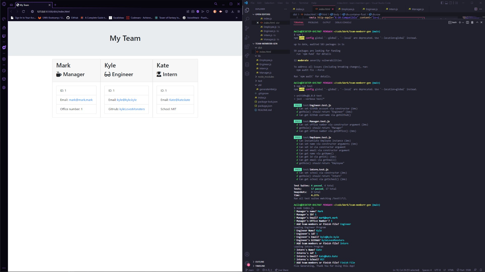

# Team Database #

## Description ##
An app for logging team member information

## Table of Contents ##
* [Description](#Description "Goto Description")
* [Features](#Features "Goto Features")
* [Installation](#installation "installation")
* [Usage Info](#Usage-Info "Usage-Info")
* [License](#License "Goto License")
* [Questions](#Questions "Goto Questions")

## Features
- Multiple positions accepted
- Manager
- Engineer
- Intern

## Installation ##
Clone Repo using SSH key on GitHub

## Usage Info ##
Open repo in console and run "npm i" followed by "node index.js"
or follow this [Video](https://github.com/deamonbunny "Instruction video")

## Images ##
Completed Cards, Tests, and Application

## License ##
This project is licensed under the terms of the **MIT** license.

## Questions ##
Reach my GitHub Account, [deamonbunny](https://github.com/deamonbunny "My GitHub")
